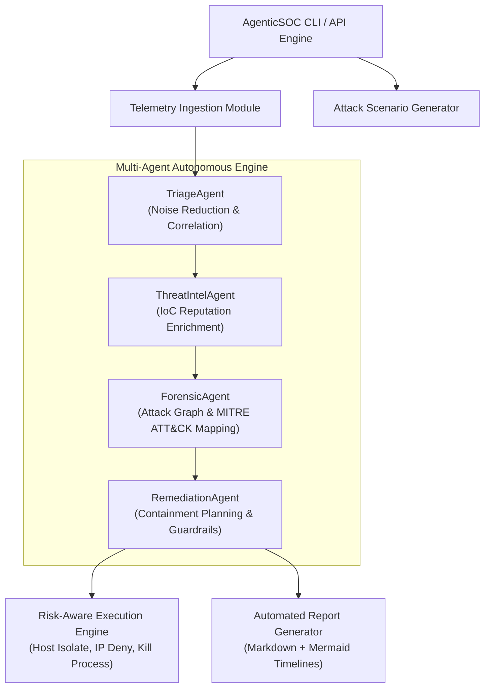

# 🛡️ AgenticSOC-Toolkit: Autonomous Multi-Agent Security Operations Framework

[](https://www.python.org/)
[](LICENSE)
[](#-multi-agent-architecture)

> **AgenticSOC-Toolkit** is a production-grade, open-source Python framework designed for cybersecurity professionals (SOC Analysts, Incident Responders, and Security Automation Engineers). It implements an autonomous multi-agent architecture that continuously monitors telemetry streams, correlates multi-stage attacks, enforces risk-aware containment actions (isolating hosts, terminating process trees, blocking C2 IPs), and generates standardized incident reports.

---

## 🗺️ Architecture Overview



---

## ⚡ Quick Features

1. **Autonomous 4-Phase Lifecycle**:
   * **Sense**: Ingests Windows Sysmon, EDR telemetry, PCAP netflows, and custom SIEM logs.
   * **Analyze**: Reconstructs process trees, maps techniques to **MITRE ATT&CK**, and scores IoC reputations.
   * **Act**: Executes machine-speed containment (EDR network isolation, process kills, firewall IP blocks, session revocation).
   * **Report**: Synthesizes professional Markdown reports with Mermaid timeline diagrams.
2. **Risk-Aware Guardrails**: Built-in protection against false positives. Critical assets (e.g., Domain Controllers) require Human-in-the-Loop (HitL) approval before host isolation.
3. **Built-in Attack Simulator**: Instantly launch realistic cyber attack telemetry streams (Phishing -> PowerShell Stager -> LSASS Dump -> C2 Beaconing) to test detection rules.
4. **Rich Terminal CLI**: Interactive terminal output using `rich` tables, panels, and live markdown preview.

---

## 🚀 Installation & Getting Started

### 1. Install Dependencies
```bash
pip install -e .
```

Or install from `requirements.txt`:
```bash
pip install -r requirements.txt
```

---

## 💻 Command-Line Interface (CLI) Usage

### 1. Run a Live Cyber Attack Simulation
Simulate a multi-stage ransomware attack and run it through the autonomous agent pipeline:
```bash
agentic-soc simulate --hostname FINANCE-WS-09 --output-report incident_report.md
```

### 2. Scan Custom Telemetry Logs
Analyze an existing JSON log file:
```bash
agentic-soc scan --file examples/sample_telemetry.json --output-report report.md
```

### 3. Check System Info
```bash
agentic-soc version
```

---

## 🔬 Multi-Agent Breakdown

| Sub-Agent | Role & Function | Output |
| :--- | :--- | :--- |
| **`TriageAgent`** | Normalizes events, correlates host/user entities, and assigns initial threat severity. | Incident Entity & Severity (`CRITICAL`/`HIGH`) |
| **`ThreatIntelAgent`** | Extracts IoCs (IPs, Hashes, Domains) and queries reputation feeds. | Enriched IoC Inventory & Threat Labels |
| **`ForensicAgent`** | Reconstructs parent/child execution graphs and maps to MITRE ATT&CK tactics. | MITRE Matrix (`T1566`, `T1059`, `T1003`, `T1071`) |
| **`RemediationAgent`** | Evaluates risk guardrails and schedules containment actions. | Containment Action Plan (Isolate, Block, Kill) |

---

## 🛡️ Risk Guardrail Specification

To prevent destructive actions in production environments:
* **Non-Critical Endpoints**: High confidence (> 85%) triggers **100% Autonomous Containment**.
* **Protected Critical Hosts** (`DC-01`, `EXECUTIVE-HOST-01`, etc.): Auto-isolation is **BLOCKED** until confirmed by a human analyst (HitL Mode).

---

## 🧪 Running Unit & Integration Tests

Run the complete test suite with `pytest`:
```bash
pytest -v
```

---

## 📄 License & Contributing

Distributed under the MIT License. Contributions and custom agent modules welcome!
